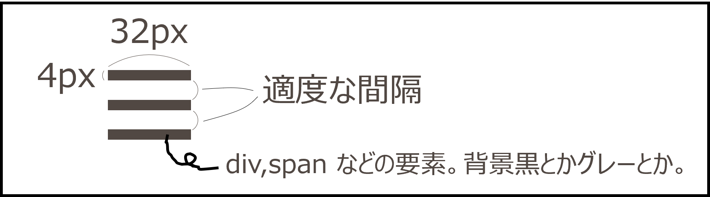

import Exercise, { Solution } from "@kodai-yamamoto-siw/exercise/client";
import { CodePreview } from "@kodai-yamamoto-siw/code-preview";

## ドロワーメニューとは

ドロワーメニューは、画面の端から引き出すように表示されるメニューです。スマートフォンサイトでよく使われる UI パターンで、ハンバーガーアイコンと組み合わせて実装されることが多いです。

このページでは、ドロワーメニューの作り方を順を追って学んでいきます。

## 演習1: ヘッダーとハンバーガーアイコンの作成

<Exercise>

まずは、ヘッダーとハンバーガーアイコンの見た目を作りましょう。以下のプレビューと同じ見た目になるように、HTML と CSS を書いてください。

但し、ハンバーガーアイコンの部分は、次の図のように、3つの要素を使って作成してください。  

<CodePreview
  sourceId="演習1"
  htmlVisible={false}
  cssVisible={false}
  jsVisible={false}
  previewVisible={true}
  initialHTML={`<header>
    <button class="ham-btn">
      
        
        
        
      
    </button>
  </header>`}
  initialCSS={`body {
      margin: 0; /* ページの端の余白をなくす */
  }

  header {
    border-bottom: solid black 1px; /* ヘッダーの下の線 */
  }

  /* ハンバーガーのボタンとアイコンの調整 */
  .ham-btn {
    display: block; /* block にしないと変な意図しない余白が勝手に入るので */
    padding: 20px;

    border: none; /* 枠線を消す */
    background: transparent; /* 背景を消す */
    cursor: pointer; /* カーソルは手のマーク */
  }

  .ham-icon {
    display: flex; /* gap を使いたいだけ */
    flex-direction: column; /* 縦並び */
    gap: 8px; /* 間隔 8px */
  }

  .ham-icon .line {
    width: 32px;
    height: 4px;

    display: block; /* span はデフォルトで display: inline なので、width, height を効かせるために block にする */
    background-color: black;
  }`}
/>

<Solution>
<CodePreview sourceId="演習1"/>
</Solution>
</Exercise>

## 演習2: メニューコンテンツの作成

<Exercise>

続いて、メニューコンテンツを作りましょう。以下のプレビューと同じ見た目になるように、HTML と CSS を書いてください。

<CodePreview
  sourceId="演習2"
  htmlVisible={false}
  cssVisible={false}
  jsVisible={false}
  previewVisible={true}
  initialHTML={`<header>
    <button class="ham-btn">
      
        
        
        
      
    </button>
  </header>
  <nav class="ham-nav">
    <ul>
      <li><a href="#">ホーム</a></li>
      <li><a href="#">サービス</a></li>
      <li><a href="#">会社情報</a></li>
      <li><a href="#">お問い合わせ</a></li>
      <li><a href="#">お問い合わせ2</a></li>
      <li><a href="#">お問い合わせ3</a></li>
      <li><a href="#">お問い合わせ4</a></li>
    </ul>
  </nav>`}
  initialCSS={`body {
      margin: 0;
  }

  header {
    border-bottom: solid black 1px;
  }

  /* ハンバーガーのボタンとアイコンの調整 */
  .ham-btn {
    display: block;
    padding: 20px;

    border: none;
    background: transparent;
    cursor: pointer;

    position: relative; /* z-index を効かせるためだけに position を relative に */
    z-index: 1; /* ハンバーガーボタンをメニューコンテンツより面に表示するため */
  }

  .ham-icon {
    display: flex;
    flex-direction: column;
    gap: 8px;
  }

  .ham-icon .line {
    width: 32px;
    height: 4px;

    display: block;
    background-color: black;
  }
  
  /* ハンバーガーのメニューコンテンツ部分の調整 */
  .ham-nav {
    position: fixed; /* 画面内で、位置固定 */
    top: 0; /* 要素の上端は画面の上端に合わせる */
    bottom: 0; /* 要素の下端は画面の下端に合わせる(top:0, bottom:0 によって高さが画面いっぱいになる) */
    left: 0; /* 画面の左端に配置 */
    background-color: white; /* 背景をつけないと透明になるから */
    box-shadow: 4px 0 6px rgba(0, 0, 0, 0.2); /* 右側に影をつける */

    padding: 60px 20px 0; /* 上に60px、左右に20px、下に0の余白 */
  }
  `}
/>

<Solution>
演習1から増えたところだけ、プロパティの後ろにコメントを書いています。
<CodePreview sourceId="演習2"/>
</Solution>
</Exercise>
